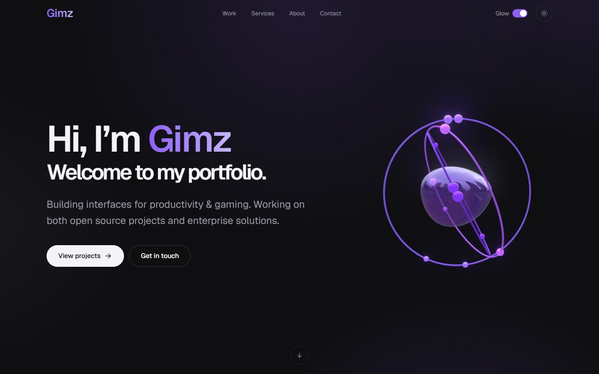
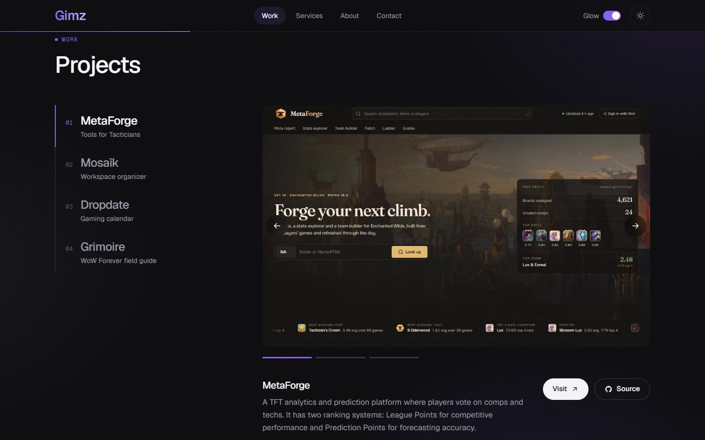
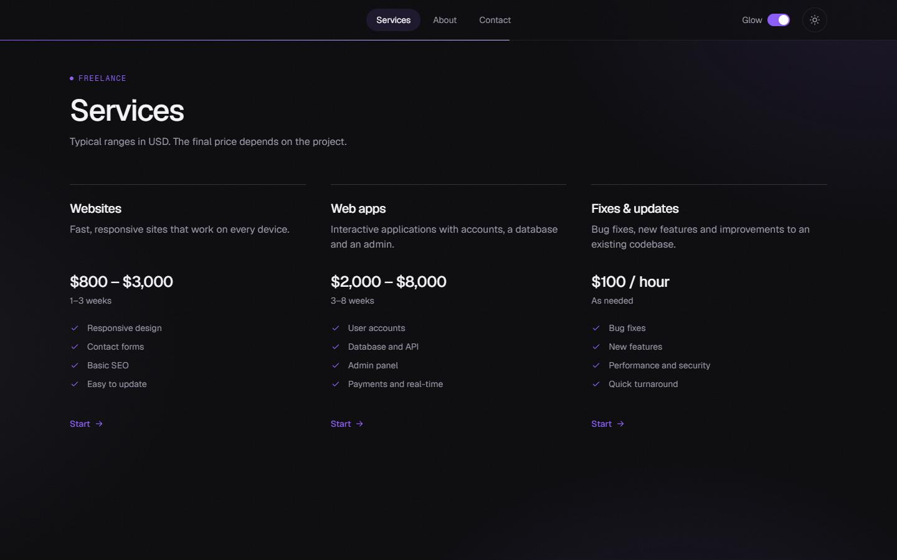
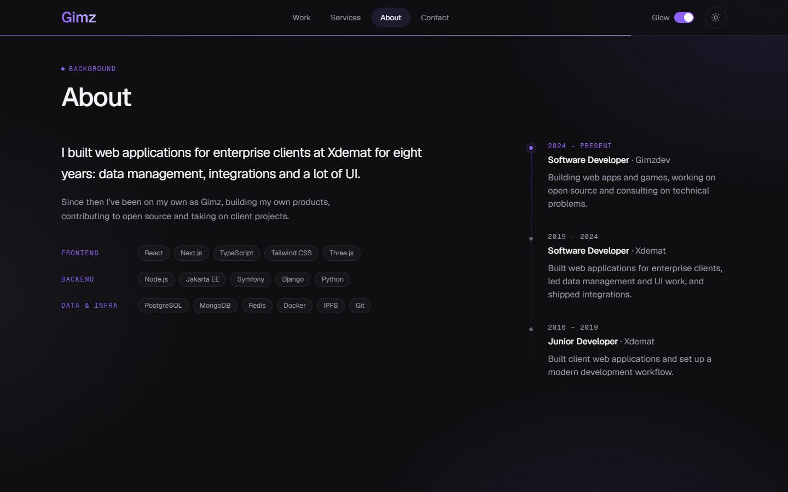

<div align="center">

<h1>Gimzdev</h1>

<h3>Personal site and project hub</h3>

[](https://nextjs.org)
[](https://typescriptlang.org)
[](https://tailwindcss.com)
[](https://threejs.org)

<hr>

<h2>About</h2>

<p>gimzdev.com is a one-page portfolio.<br>
It shows the projects, the freelance services on offer,<br>
the background behind them, and a contact form.</p>

<p>The hero has a 3D scene. The header has a cursor glow switch<br>
and a light and dark theme toggle.</p>

<table align="center">
<tr>
<td align="center" width="50%">

<h3>Work</h3>

MetaForge, Mosaïk,<br>
Dropdate, Grimoire<br>
Screenshot carousels<br>
Live and source links

</td>
<td align="center" width="50%">

<h3>Services</h3>

Websites, web apps,<br>
fixes and updates<br>
Typical prices and timelines

</td>
</tr>
<tr>
<td align="center" width="50%">

<h3>About</h3>

Background and skills<br>
by area<br>
Career timeline

</td>
<td align="center" width="50%">

<h3>Contact</h3>

Message form and email<br>
GitHub, X and Discord

</td>
</tr>
</table>

<hr>

<h2>Screenshots</h2>

<table align="center">
<tr>
<td align="center" width="50%">



<sub>Hero</sub>

</td>
<td align="center" width="50%">



<sub>Work</sub>

</td>
</tr>
<tr>
<td align="center" width="50%">



<sub>Services</sub>

</td>
<td align="center" width="50%">



<sub>About</sub>

</td>
</tr>
</table>

<hr>


<h2>Stack</h2>

<table align="center">
<tr>
<td align="center" width="33%">

<h3>Framework</h3>

Next.js<br>
App Router<br>
TypeScript

</td>
<td align="center" width="33%">

<h3>Visuals</h3>

Tailwind CSS<br>
Three.js<br>
postprocessing<br>
Geist

</td>
<td align="center" width="33%">

<h3>Contact form</h3>

Nodemailer<br>
Any SMTP server

</td>
</tr>
</table>

<hr>

<h2>Setup</h2>

<p>Needs Node.js 20.9 or newer.</p>

```bash
git clone https://github.com/gimzdev/portfolio.git
cd portfolio

npm install
npm run dev
```

<hr>

<h2>Contact form</h2>

<p>The form sends mail over SMTP. Add your server to <code>.env.local</code>:</p>

```bash
EMAIL_HOST=smtp.example.com
EMAIL_PORT=587
EMAIL_SECURE=false
EMAIL_USER=you@example.com
EMAIL_PASSWORD=your-password

# optional
# EMAIL_FROM=
# EMAIL_TO=
```

<hr>

[](https://gimzdev.com)

</div>
